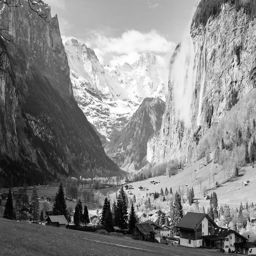
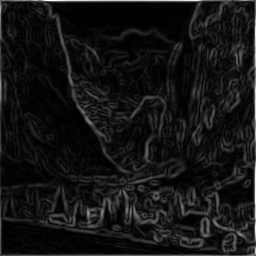

# RISC-V Canny Edge Detection

Canny edge detection pipeline targeting **rv64gcv**, running on QEMU user-mode emulation.

| Item | Details |
|------|---------|
| Language | C++ (C++17) |
| Target | RISC-V rv64gcv |
| Emulator | QEMU 8.x+ |
| Team | 5 engineers |
| Duration | 4 weeks |

---

## What This Project Does

Implements the Canny edge detection algorithm in C++ and optimizes it using
RISC-V Vector (RVV) intrinsics. The pipeline has 5 stages:

1. **Gaussian Blur** — smooths the image to reduce noise (5×5 kernel)
2. **Sobel Gradient** — finds edges using Gx and Gy kernels
3. **Gradient Magnitude** — computes edge strength (L1 and L2)
4. **Gradient Direction** — quantizes direction to 0°/45°/90°/135°
5. **RVV Optimization** — hand-vectorized kernels using RISC-V Vector intrinsics

---

## Sample Results

| Input | Edge Output |
|-------|-------------|
|  |  |

---

## Requirements

- Linux (Ubuntu 24.04 / Debian 13) or Windows with WSL2
- RISC-V GNU toolchain built with `--with-arch=rv64gcv`
- QEMU built for `riscv64-linux-user`
- GoogleTest (for host-side unit tests)

---

## Environment Setup

### 1. RISC-V Toolchain
```bash
git clone https://github.com/riscv-collab/riscv-gnu-toolchain
cd riscv-gnu-toolchain
./configure --prefix=/opt/riscv --with-arch=rv64gcv --with-abi=lp64d
sudo make linux -j$(nproc)
echo 'export PATH=$PATH:/opt/riscv/bin' >> ~/.bashrc
echo 'export QEMU_LD_PREFIX=/opt/riscv/sysroot' >> ~/.bashrc
source ~/.bashrc
```

### 2. QEMU
```bash
git clone https://github.com/qemu/qemu --depth 1
cd qemu
mkdir build && cd build
../configure --target-list=riscv64-linux-user --prefix=/opt/qemu
make -j$(nproc)
sudo make install
echo 'export PATH=$PATH:/opt/qemu/bin' >> ~/.bashrc
source ~/.bashrc
```

### 3. GoogleTest (host-side tests only)
```bash
git clone https://github.com/google/googletest --depth 1 ~/googletest
cd ~/googletest
cmake -B build -DCMAKE_INSTALL_PREFIX=$HOME/.local
cmake --build build -j$(nproc)
cmake --install build
```

---

## Clone and Build

```bash
git clone https://github.com/kareem-khalifa-06/riscv-canny-edge
cd riscv-canny-edge
make canny_rv
```

---

## Run

### Generate a test image
```bash
dd if=/dev/urandom of=input.raw bs=1 count=65536
```

### Or convert your own image (requires Pillow + numpy)
```bash
pip3 install Pillow numpy --break-system-packages
python3 convert_to_raw.py
```

### Run the pipeline on QEMU
```bash
qemu-riscv64 -cpu rv64,v=true,vlen=256 build/rv/canny_rv 256 256 input.raw output
```

### Run at different VLEN values
```bash
qemu-riscv64 -cpu rv64,v=true,vlen=128 build/rv/canny_rv 256 256 input.raw output
qemu-riscv64 -cpu rv64,v=true,vlen=256 build/rv/canny_rv 256 256 input.raw output
qemu-riscv64 -cpu rv64,v=true,vlen=512 build/rv/canny_rv 256 256 input.raw output
```

---

## Make Targets

| Command | Description |
|---------|-------------|
| `make canny_rv` | Cross-compile for RISC-V |
| `make run` | Run on QEMU at VLEN=256 |
| `make test` | Run GoogleTest suite (host-side) |
| `make clean` | Remove build artifacts |

---

## Generate Synthetic Test Images

```bash
g++ tools/gen_test_image.cpp -o build/gen_test_image
./build/gen_test_image 256 256
```

Generates 8 test patterns:
- `test_black.raw` — all black
- `test_white.raw` — all white
- `test_uniform128.raw` — uniform grey
- `test_vertical_edge.raw` — left=black, right=white
- `test_horizontal_edge.raw` — top=black, bottom=white
- `test_diagonal_edge.raw` — diagonal edge
- `test_rectangle.raw` — white rectangle on black
- `test_impulse.raw` — single bright pixel

---

## Repo Structure
riscv-canny-edge/
├── src/                  ← scalar C++ pipeline
│   ├── image_io.cpp/h    ← load/save raw images
│   ├── gaussian.cpp/h    ← Gaussian blur (5×5, templated)
│   ├── sobel.cpp/h       ← Sobel gradient (Gx, Gy)
│   ├── magnitude.cpp/h   ← L1 and L2 magnitude
│   ├── direction.cpp/h   ← gradient direction
│   └── main.cpp          ← pipeline entry point with timing
├── rvv/                  ← RVV intrinsic optimizations
├── tests/                ← GoogleTest unit tests
├── tools/                ← test image generator
├── docs/                 ← sample images, reports
├── Makefile
├── README.md
├── AI_USAGE_LOG.md
└── .gitignore
---

## Optimization Results

| Stage | -O0 | -O2 | -O3 | -Ofast |
|-------|-----|-----|-----|--------|
| Gaussian Blur | 28.7ms | 211.6ms | 3.6ms | 5.8ms |
| Sobel Gradient | 50.5ms | 4.5ms | 0.9ms | 0.8ms |
| Magnitude L1 | 2.2ms | 3.7ms | 7.4ms | 6.4ms |
| Magnitude L2 | 32.8ms | 19.0ms | 20.5ms | 18.4ms |
| Direction | 1.4ms | 0.8ms | 5.5ms | 4.6ms |
| **Total** | **115.7ms** | **239.6ms** | **37.9ms** | **36.0ms** |
| Binary Size | 19KB | 15KB | 19KB | 19KB |

---

## Auto-vectorization Analysis

The compiler successfully vectorized:
- Magnitude L1 and L2 loops ✅
- Direction loop ✅

The compiler failed to vectorize:
- Gaussian blur — boundary check prevents vectorization ❌
- Sobel gradient — unsupported control flow ❌

This justifies manual RVV intrinsic implementation for Gaussian and Sobel.
See `docs/autovec_report.txt` for the full report.

---

## Team

| Role | Engineer | Responsibility |
|------|----------|---------------|
| E1 — Infrastructure | kareem-khalifa-06 | Toolchain, QEMU, Makefile, repo |
| E2 — Scalar Pipeline | mohamedhamdy2f | Gaussian, Sobel, Magnitude, Direction |
| E3 — Testing & QA | kareem-maher577 | GoogleTest, equivalence tests |
| E4 — Compiler Opt. | Mohamed-Osama05 | Flag sweep, profiling |
| E5 — RVV Intrinsics | engmohamedg500 | RVV kernels, LMUL sweep |

